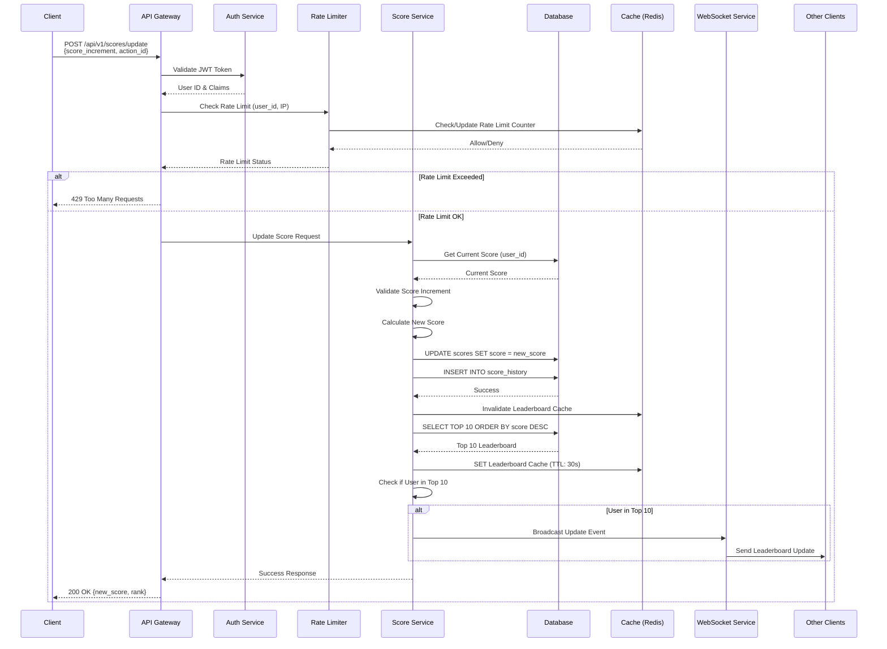
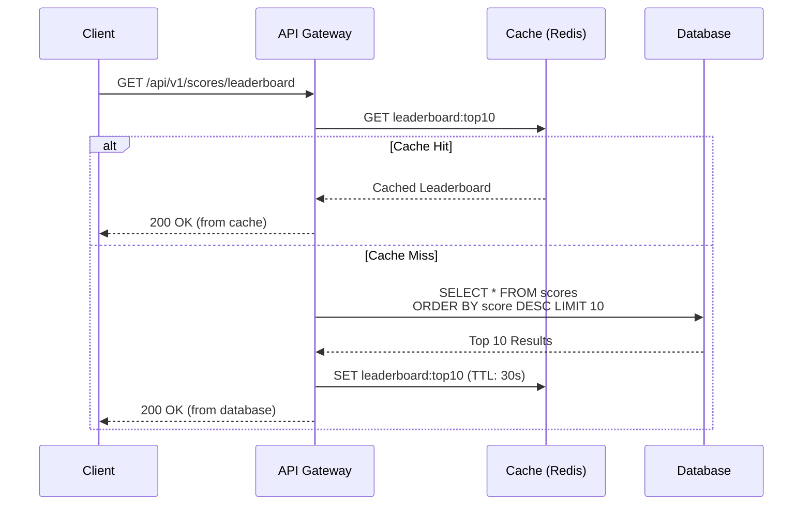
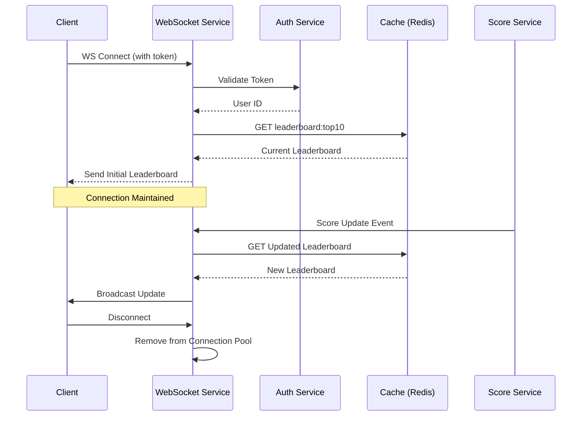

# Scoreboard Module Specification

> **Implementation Status**: ✅ **COMPLETE**  
> This specification includes a full working implementation with Docker support. See [docs/SETUP.md](./docs/SETUP.md) for installation instructions, [docs/DOCKER.md](./docs/DOCKER.md) for Docker setup, and [docs/IMPLEMENTATION.md](./docs/IMPLEMENTATION.md) for code details.

## 🚀 Quick Start with Docker

The easiest way to get started:

```bash
docker-compose up
```

This will start PostgreSQL, Redis, and the application. See [docs/DOCKER.md](./docs/DOCKER.md) for details.

## 📚 API Documentation

Interactive API documentation is available at:

- **Swagger UI**: `http://localhost:3000/api-docs`

The Swagger documentation includes:

- All API endpoints with descriptions
- Request/response schemas
- Authentication requirements
- Try-it-out functionality to test endpoints directly

See [docs/SWAGGER_TESTING.md](./docs/SWAGGER_TESTING.md) for a complete guide on testing with Swagger.

## 🚀 Production Deployment

For production deployment instructions, see [docs/PRODUCTION_DEPLOYMENT.md](./docs/PRODUCTION_DEPLOYMENT.md).

The guide covers:

- Docker production deployment
- Manual server setup
- Security best practices
- Monitoring and scaling
- Backup and recovery procedures

## 📋 NPM Scripts

All available npm scripts are documented in [docs/SCRIPTS.md](./docs/SCRIPTS.md).

Quick reference:

- `npm run dev` - Start development server with hot-reload
- `npm test` - Run unit tests
- `npm run test:integration` - Run integration tests (requires Docker)
- `npm run format` - Format code with Prettier
- `npm run type-check` - Check TypeScript types

## 🔧 Pre-commit Hooks

This project uses [Husky](https://typicode.github.io/husky/) to run pre-commit hooks that ensure code quality:

- **Formatting**: Automatically formats staged files with Prettier
- **Type Checking**: Validates TypeScript types
- **Testing**: Runs tests for changed files

If pre-commit hooks aren't working, see [docs/HUSKY_TROUBLESHOOTING.md](./docs/HUSKY_TROUBLESHOOTING.md) for setup and troubleshooting.

## ✅ Requirements Compliance

This implementation fully meets all original requirements and includes significant improvements. See [docs/REQUIREMENTS_COMPLIANCE.md](./docs/REQUIREMENTS_COMPLIANCE.md) for a detailed comparison of requirements vs. implementation, including all enhancements made.

**Quick Summary**:

- ✅ Top 10 scoreboard with live updates
- ✅ Action-based score updates via API
- ✅ Comprehensive security (JWT, rate limiting, validation)
- ✅ Production-ready with Docker, testing, and documentation

## Table of Contents

1. [Overview](#overview)
2. [Architecture](#architecture)
3. [API Specifications](#api-specifications)
4. [Database Design](#database-design)
5. [Real-time Updates](#real-time-updates)
6. [Security & Authorization](#security--authorization)
7. [Flow Diagram](#flow-diagram)
8. [Implementation Considerations](#implementation-considerations)
9. [Improvements & Recommendations](#improvements--recommendations)

---

## Overview

This module implements a real-time scoreboard system that displays the top 10 users' scores with live updates. The system handles score updates through authenticated API calls and broadcasts changes to connected clients in real-time.

### Key Features

- Real-time scoreboard updates (top 10 users)
- Secure score update API with authentication
- Rate limiting and abuse prevention
- Scalable architecture for high concurrency
- Efficient leaderboard queries with caching

---

## Architecture

### High-Level Architecture

The system follows a **microservices-oriented architecture** with the following components:

1. **API Gateway/Server**: Handles HTTP requests, authentication, and rate limiting
2. **Score Service**: Core business logic for score management
3. **Leaderboard Service**: Manages top 10 leaderboard queries and caching
4. **Real-time Service**: Handles WebSocket connections for live updates
5. **Database**: Persistent storage for user scores
6. **Cache Layer**: Redis for leaderboard caching and rate limiting
7. **Message Queue**: Event-driven updates (optional, for scalability)

### Technology Stack Recommendations

- **Backend Framework**: Node.js (Express/Fastify), Python (FastAPI), or Go (Gin)
- **Database**: PostgreSQL or MySQL for persistent storage
- **Cache**: Redis for leaderboard cache and rate limiting
- **Real-time**: WebSocket (Socket.io, ws, or native WebSocket)
- **Message Queue**: Redis Pub/Sub or RabbitMQ (for distributed systems)
- **Authentication**: JWT tokens or OAuth 2.0

---

## API Specifications

### 1. Update Score Endpoint

**Endpoint**: `POST /api/v1/scores/update`

**Authentication**: Required (Bearer Token)

**Request Headers**:

```
Authorization: Bearer <jwt_token>
Content-Type: application/json
```

**Request Body**:

```json
{
  "score_increment": 10,
  "action_id": "action_12345",
  "timestamp": 1699123456789
}
```

**Response (Success - 200 OK)**:

```json
{
  "success": true,
  "data": {
    "user_id": "user_123",
    "previous_score": 150,
    "new_score": 160,
    "rank": 5,
    "is_top_10": true
  },
  "message": "Score updated successfully"
}
```

**Response (Error - 400 Bad Request)**:

```json
{
  "success": false,
  "error": {
    "code": "INVALID_REQUEST",
    "message": "Invalid score increment value"
  }
}
```

**Response (Error - 401 Unauthorized)**:

```json
{
  "success": false,
  "error": {
    "code": "UNAUTHORIZED",
    "message": "Invalid or expired token"
  }
}
```

**Response (Error - 429 Too Many Requests)**:

```json
{
  "success": false,
  "error": {
    "code": "RATE_LIMIT_EXCEEDED",
    "message": "Too many requests. Please try again later.",
    "retry_after": 60
  }
}
```

### 2. Get Leaderboard Endpoint

**Endpoint**: `GET /api/v1/scores/leaderboard`

**Authentication**: Optional (for personalized rank)

**Query Parameters**:

- `limit` (optional): Number of top users to return (default: 10, max: 100)
- `offset` (optional): Pagination offset (default: 0)

**Request Headers** (optional):

```
Authorization: Bearer <jwt_token>
```

**Response (200 OK)**:

```json
{
  "success": true,
  "data": {
    "leaderboard": [
      {
        "user_id": "user_456",
        "username": "player1",
        "score": 500,
        "rank": 1
      },
      {
        "user_id": "user_789",
        "username": "player2",
        "score": 450,
        "rank": 2
      }
      // ... up to 10 entries
    ],
    "user_rank": 5, // Only if authenticated
    "total_users": 1250,
    "last_updated": "2024-01-15T10:30:00Z"
  }
}
```

### 3. WebSocket Connection

**Endpoint**: `WS /api/v1/scores/live`

**Authentication**: Required (Token passed as query parameter or in initial handshake)

**Connection**:

```
wss://api.example.com/api/v1/scores/live?token=<jwt_token>
```

**Message Format (Server → Client)**:

```json
{
  "type": "scoreboard_update",
  "data": {
    "leaderboard": [...],
    "updated_user": {
      "user_id": "user_123",
      "new_score": 160,
      "new_rank": 5
    },
    "timestamp": "2024-01-15T10:30:00Z"
  }
}
```

**Message Format (Client → Server)**:

```json
{
  "type": "subscribe",
  "channel": "leaderboard"
}
```

---

## Database Design

### Users Table

```sql
CREATE TABLE users (
    user_id VARCHAR(255) PRIMARY KEY,
    username VARCHAR(100) NOT NULL UNIQUE,
    email VARCHAR(255) NOT NULL UNIQUE,
    created_at TIMESTAMP DEFAULT CURRENT_TIMESTAMP,
    updated_at TIMESTAMP DEFAULT CURRENT_TIMESTAMP ON UPDATE CURRENT_TIMESTAMP,
    INDEX idx_username (username)
);
```

### Scores Table

```sql
CREATE TABLE scores (
    id BIGINT AUTO_INCREMENT PRIMARY KEY,
    user_id VARCHAR(255) NOT NULL,
    score BIGINT NOT NULL DEFAULT 0,
    updated_at TIMESTAMP DEFAULT CURRENT_TIMESTAMP ON UPDATE CURRENT_TIMESTAMP,
    FOREIGN KEY (user_id) REFERENCES users(user_id) ON DELETE CASCADE,
    INDEX idx_user_id (user_id),
    INDEX idx_score_desc (score DESC),
    UNIQUE KEY unique_user_score (user_id)
);
```

### Score History Table (Audit Trail)

```sql
CREATE TABLE score_history (
    id BIGINT AUTO_INCREMENT PRIMARY KEY,
    user_id VARCHAR(255) NOT NULL,
    score_increment INT NOT NULL,
    previous_score BIGINT NOT NULL,
    new_score BIGINT NOT NULL,
    action_id VARCHAR(255),
    ip_address VARCHAR(45),
    user_agent TEXT,
    created_at TIMESTAMP DEFAULT CURRENT_TIMESTAMP,
    FOREIGN KEY (user_id) REFERENCES users(user_id) ON DELETE CASCADE,
    INDEX idx_user_id (user_id),
    INDEX idx_created_at (created_at)
);
```

### Indexes for Performance

- Composite index on `(score DESC, user_id)` for efficient leaderboard queries
- Index on `user_id` for fast user score lookups
- Index on `created_at` in score_history for time-based queries

---

## Real-time Updates

### WebSocket Implementation

1. **Connection Management**:
   - Clients connect via WebSocket with authentication token
   - Server validates token and maintains connection pool
   - Heartbeat mechanism (ping/pong) to detect dead connections

2. **Update Broadcasting**:
   - When a score update occurs, check if it affects top 10
   - If yes, fetch updated leaderboard from cache
   - Broadcast update to all connected clients
   - Use Redis Pub/Sub for multi-server deployments

3. **Connection Lifecycle**:
   ```
   Client → Connect with token
   Server → Validate token
   Server → Add to connection pool
   Server → Send initial leaderboard state
   [Score Update Event]
   Server → Broadcast to all connected clients
   Client → Disconnect
   Server → Remove from connection pool
   ```

### Alternative: Server-Sent Events (SSE)

For simpler implementation, SSE can be used instead of WebSocket:

- **Endpoint**: `GET /api/v1/scores/leaderboard/stream`
- **Authentication**: Bearer token in headers
- **Connection**: Long-lived HTTP connection
- **Updates**: Server pushes events as they occur

---

## Security & Authorization

### 1. Authentication

- **JWT Tokens**: All score update requests require valid JWT
- **Token Validation**: Verify signature, expiration, and user claims
- **Token Refresh**: Implement refresh token mechanism for long sessions

### 2. Authorization

- **User Identity**: Extract user_id from JWT token (cannot be spoofed)
- **Score Ownership**: Users can only update their own scores
- **Action Validation**: Verify that the action_id corresponds to a legitimate action

### 3. Rate Limiting

- **Per-User Rate Limit**: Maximum N score updates per minute per user
- **IP-Based Rate Limit**: Additional protection against abuse
- **Sliding Window**: Use Redis with sliding window algorithm
- **Recommended Limits**:
  - 60 requests per minute per user
  - 1000 requests per minute per IP

### 4. Input Validation

- **Score Increment**: Must be positive integer, within reasonable bounds (e.g., 1-1000)
- **Action ID**: Must be valid UUID or alphanumeric string
- **Timestamp**: Validate to prevent replay attacks (within 5-minute window)

### 5. Anti-Fraud Measures

- **Action Verification**: Maintain a log of valid actions per user
- **Anomaly Detection**: Flag suspicious patterns (e.g., 1000 updates in 1 second)
- **Score Cap**: Implement maximum score increment per action
- **Time-based Validation**: Ensure actions are completed before score update

### 6. Security Headers

- CORS configuration for allowed origins
- HTTPS enforcement
- Rate limit headers in responses
- Security headers (X-Content-Type-Options, X-Frame-Options, etc.)

---

## Flow Diagram



### Leaderboard Query Flow



### WebSocket Connection Flow



---

## Implementation Considerations

### 1. Caching Strategy

- **Leaderboard Cache**: Store top 10 in Redis with 30-second TTL
- **User Score Cache**: Cache individual user scores with 5-minute TTL
- **Cache Invalidation**: Invalidate on score updates that affect top 10
- **Cache Warming**: Pre-populate cache on application startup

### 2. Database Optimization

- **Read Replicas**: Use read replicas for leaderboard queries
- **Connection Pooling**: Configure appropriate connection pool size
- **Query Optimization**: Use EXPLAIN to optimize leaderboard query
- **Partitioning**: Consider partitioning scores table by date if it grows large

### 3. Scalability

- **Horizontal Scaling**: Stateless API servers behind load balancer
- **WebSocket Scaling**: Use Redis Pub/Sub for cross-server WebSocket communication
- **Database Sharding**: Shard by user_id if user base grows significantly
- **CDN**: Serve static leaderboard data via CDN for high read traffic

### 4. Error Handling

- **Retry Logic**: Implement exponential backoff for transient failures
- **Circuit Breaker**: Prevent cascade failures
- **Graceful Degradation**: Return cached data if database is unavailable
- **Logging**: Comprehensive logging for debugging and monitoring

### 5. Monitoring & Observability

- **Metrics**: Request rate, latency, error rate, cache hit ratio
- **Alerts**: High error rate, database connection issues, rate limit violations
- **Tracing**: Distributed tracing for request flow
- **Logging**: Structured logging with correlation IDs

### 6. Testing Strategy

- **Unit Tests**: Test score calculation, validation logic
- **Integration Tests**: Test API endpoints with test database
- **Load Tests**: Simulate high concurrent score updates
- **Security Tests**: Test authentication, authorization, rate limiting

---

## Improvements & Recommendations

### 1. Event-Driven Architecture

**Current**: Synchronous score updates  
**Improvement**: Implement event-driven architecture with message queue

**Benefits**:

- Decouple score updates from leaderboard broadcasting
- Better scalability and fault tolerance
- Easier to add new features (notifications, analytics)

**Implementation**:

- Use Redis Streams or RabbitMQ
- Score update → Publish event → Multiple consumers (leaderboard, notifications, analytics)

### 2. Advanced Caching

**Current**: Simple Redis cache with TTL  
**Improvement**: Multi-layer caching strategy

**Implementation**:

- L1: In-memory cache (Caffeine/Guava) for ultra-fast access
- L2: Redis cache for distributed access
- L3: Database for persistence
- Smart invalidation based on update patterns

### 3. Leaderboard Algorithm Optimization

**Current**: Full table scan for top 10  
**Improvement**: Use specialized data structures

**Options**:

- **Redis Sorted Sets**: Native leaderboard support with O(log N) operations
- **Skip List**: Efficient top-K queries
- **Materialized View**: Pre-computed leaderboard in database

**Recommended**: Redis Sorted Sets for real-time leaderboard

```redis
ZADD leaderboard 500 user_456
ZADD leaderboard 450 user_789
ZREVRANGE leaderboard 0 9 WITHSCORES
```

### 4. Enhanced Security

**Current**: Basic JWT + rate limiting  
**Improvements**:

a. **Action Verification Service**:

- Separate service that validates actions before score updates
- Action tokens that expire after completion
- Prevents replay attacks

b. **Machine Learning Anomaly Detection**:

- Detect unusual patterns (sudden score spikes, coordinated attacks)
- Auto-flag suspicious accounts for review

c. **IP Reputation Check**:

- Integrate with IP reputation services
- Block known malicious IPs

d. **CAPTCHA for High-Frequency Updates**:

- Require CAPTCHA after N updates in short time

### 5. Data Consistency

**Current**: Eventual consistency  
**Improvement**: Stronger consistency guarantees where needed

**Implementation**:

- Use database transactions for score updates
- Implement optimistic locking to prevent race conditions
- Consider distributed locks (Redis) for critical sections

### 6. Performance Enhancements

a. **Batch Updates**:

- Allow batch score updates to reduce API calls
- Process in background with queue

b. **Read Optimization**:

- Use database read replicas
- Implement GraphQL for flexible queries
- Add pagination for leaderboard beyond top 10

c. **WebSocket Optimization**:

- Implement message compression
- Use binary protocols (MessagePack) instead of JSON
- Connection pooling and reuse

### 7. Feature Enhancements

a. **Time-based Leaderboards**:

- Daily, weekly, monthly leaderboards
- All-time leaderboard
- Historical rankings

b. **User Profiles**:

- Show user's rank, percentile
- Score history graph
- Achievement badges

c. **Notifications**:

- Notify users when they enter/exit top 10
- Notify when rank changes significantly

d. **Analytics Dashboard**:

- Real-time metrics
- User engagement statistics
- Score distribution charts

### 8. Reliability Improvements

a. **Database Backup**:

- Automated daily backups
- Point-in-time recovery
- Backup verification

b. **Disaster Recovery**:

- Multi-region deployment
- Automated failover
- Data replication

c. **Graceful Shutdown**:

- Drain connections before shutdown
- Complete in-flight requests
- Save state before termination

### 9. Developer Experience

a. **API Versioning**:

- Clear versioning strategy (URL-based: /api/v1/)
- Deprecation policy
- Migration guides

b. **Documentation**:

- OpenAPI/Swagger specification
- Code examples in multiple languages
- Interactive API explorer

c. **SDK Development**:

- Client SDKs for popular languages
- WebSocket client libraries
- Example applications

### 10. Compliance & Privacy

a. **GDPR Compliance**:

- User data deletion endpoint
- Data export functionality
- Privacy policy integration

b. **Audit Logging**:

- Comprehensive audit trail
- Immutable logs
- Compliance reporting

---

## Conclusion

This specification provides a comprehensive foundation for implementing a secure, scalable, and real-time scoreboard system. The architecture balances performance, security, and maintainability while providing clear implementation guidelines for the backend engineering team.

**Priority Implementation Order**:

1. Core API endpoints (update score, get leaderboard)
2. Authentication and authorization
3. Rate limiting
4. Database schema and queries
5. Caching layer
6. WebSocket real-time updates
7. Monitoring and logging
8. Advanced features (as per improvements section)

**Estimated Development Time**:

- Core implementation: 2-3 weeks
- Security hardening: 1 week
- Real-time features: 1 week
- Testing and optimization: 1 week
- **Total: 5-6 weeks** for production-ready system

---

## Appendix

### Environment Variables

```bash
# Database
DB_HOST=localhost
DB_PORT=5432
DB_NAME=scoreboard
DB_USER=scoreboard_user
DB_PASSWORD=secure_password

# Redis
REDIS_HOST=localhost
REDIS_PORT=6379
REDIS_PASSWORD=redis_password

# JWT
JWT_SECRET=your-secret-key
JWT_EXPIRATION=24h

# Rate Limiting
RATE_LIMIT_PER_USER=60
RATE_LIMIT_PER_IP=1000
RATE_LIMIT_WINDOW=60

# WebSocket
WS_HEARTBEAT_INTERVAL=30
WS_MAX_CONNECTIONS=10000
```

### Sample Code Structure

```
scoreboard-service/
├── src/
│   ├── controllers/
│   │   ├── score.controller.ts
│   │   └── leaderboard.controller.ts
│   ├── services/
│   │   ├── score.service.ts
│   │   ├── leaderboard.service.ts
│   │   └── websocket.service.ts
│   ├── middleware/
│   │   ├── auth.middleware.ts
│   │   └── rateLimit.middleware.ts
│   ├── models/
│   │   ├── user.model.ts
│   │   └── score.model.ts
│   ├── utils/
│   │   ├── cache.ts
│   │   └── validator.ts
│   └── routes/
│       └── score.routes.ts
├── tests/
├── docs/
└── README.md
```
